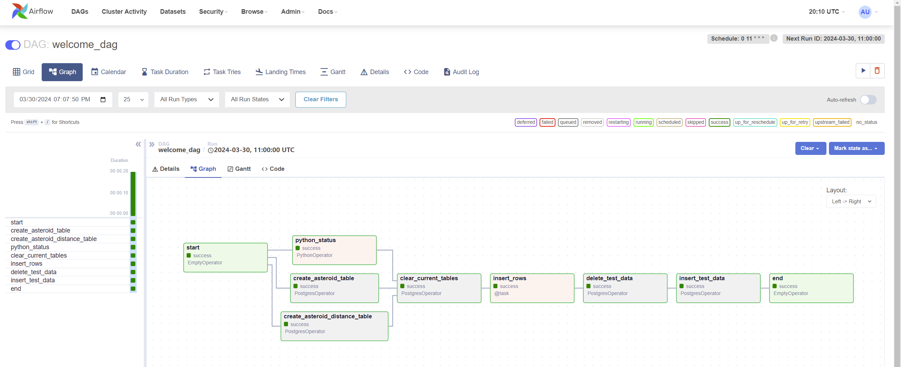
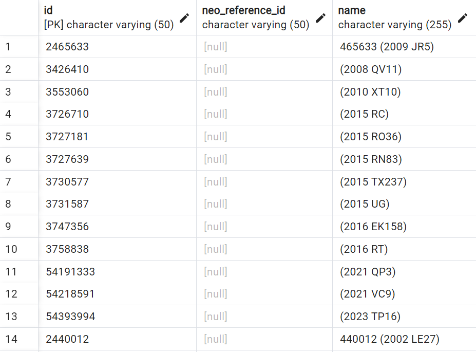
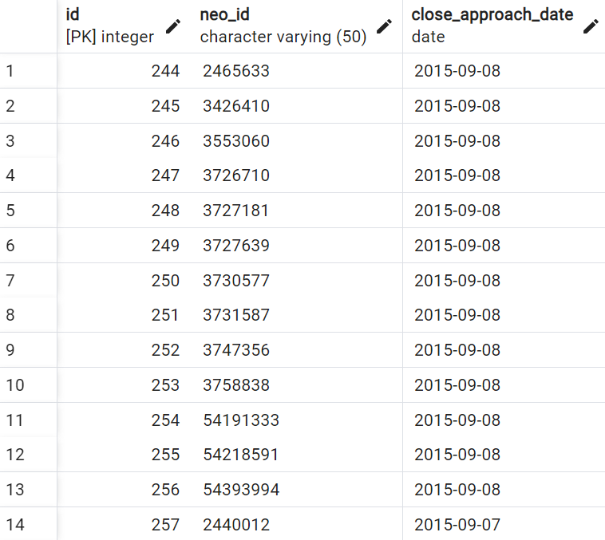
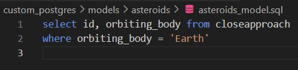
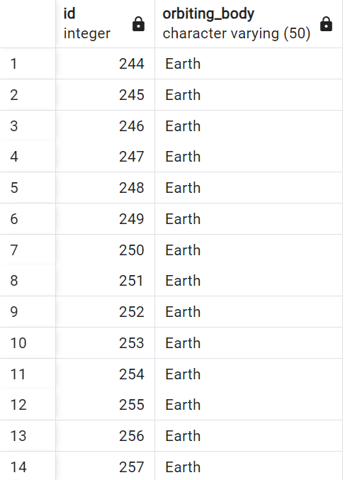

# What is it?

A data pipeline that pulls data from NASA asteroids api and 
stores it to a postgresql database using airflow, docker, postgresql, and python.

# Using airflow and postgres to make a data pipeline

# Dbt models

## Asteroids that orbit Earth model
 

