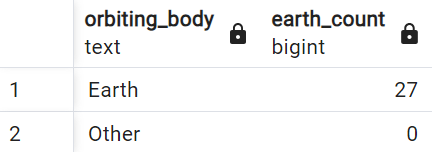
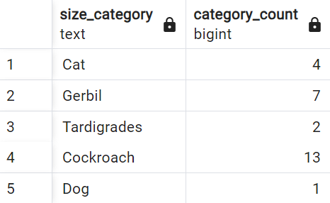
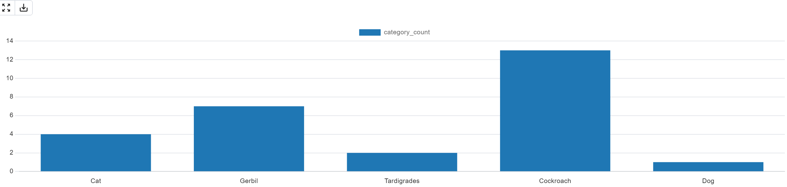
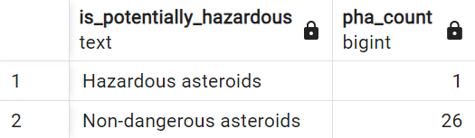
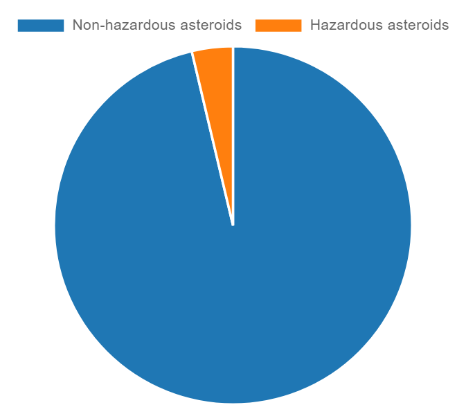

# What is it?

A data pipeline that pulls data from NASA asteroids api and 
stores it to a postgresql database server using airflow, docker, postgresql, and python. I used dbt to model the data once the data is populated in the postgresql server.

# Data pipeline from NASA api to postgresql server 
 

# Dbt models

## Asteroids that orbit Earth model
! [alt text](image-8.png)
## Asteroids population distribution animal size comparison model
 
## Hazardous vs non-hazardous asteroids
 